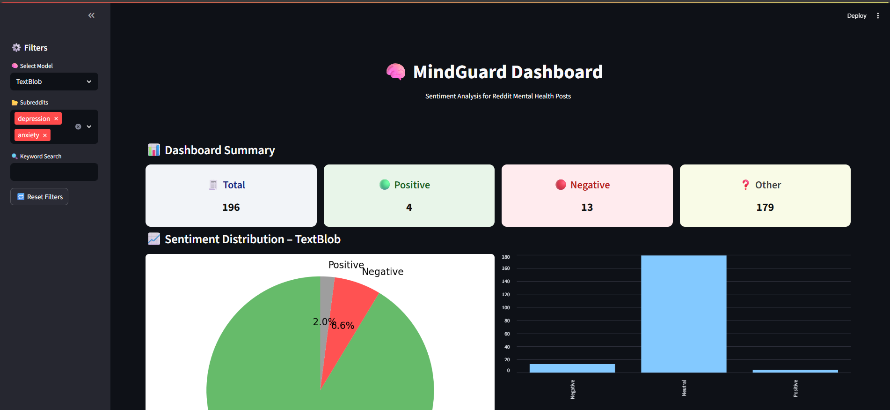

# 🧠 MindGuard – Mental Health Sentiment Analyzer (Reddit NLP Dashboard)

MindGuard is an end-to-end, real-time NLP dashboard that monitors Reddit posts related to mental health. It uses both **TextBlob** and **BERT (Transformer)** models to detect signs of anxiety, depression, and emotional distress. Built with **Streamlit**, the dashboard offers sentiment comparison, filters, and rich visual analytics.



---

## 🧠 Project Motivation

> With rising mental health concerns globally, many people share their feelings anonymously online. By analyzing these expressions through natural language processing, MindGuard aims to assist researchers, moderators, or public health professionals in identifying signs of distress at scale.

---

## 🔍 Features

- ✅ Collects Reddit posts from mental health-focused subreddits
- ✅ Cleans and fuses title + body text
- ✅ Performs dual sentiment analysis using:
  - **TextBlob** (lexicon-based)
  - **BERT** (`cardiffnlp/twitter-roberta-base-sentiment`)
- ✅ Filters posts by subreddit, model, or keywords
- ✅ Visualizations: bar charts, pie charts, and summary cards
- ✅ Highlights mismatches between TextBlob and BERT
- ✅ Download the processed data as CSV

---

## 💻 Tech Stack

| Layer         | Tools Used                           |
| ------------- | ------------------------------------ |
| Frontend      | Streamlit                            |
| NLP Models    | TextBlob, Transformers (BERT)        |
| Data Source   | Reddit (via Pushshift API)           |
| Processing    | Python, Pandas, NumPy                |
| Visualization | Streamlit, Matplotlib                |
| Deployment    | Streamlit Cloud                      |
| Storage       | CSV (MongoDB optional for extension) |

---

## 🧪 How to Run Locally

```bash
git clone https://github.com/Sachin7123/mindguard.git
cd mindguard-nlp
python -m venv venv
# For Windows:
venv\Scripts\activate
# For macOS/Linux:
source venv/bin/activate

pip install -r requirements.txt
streamlit run app/dashboard.py
```
